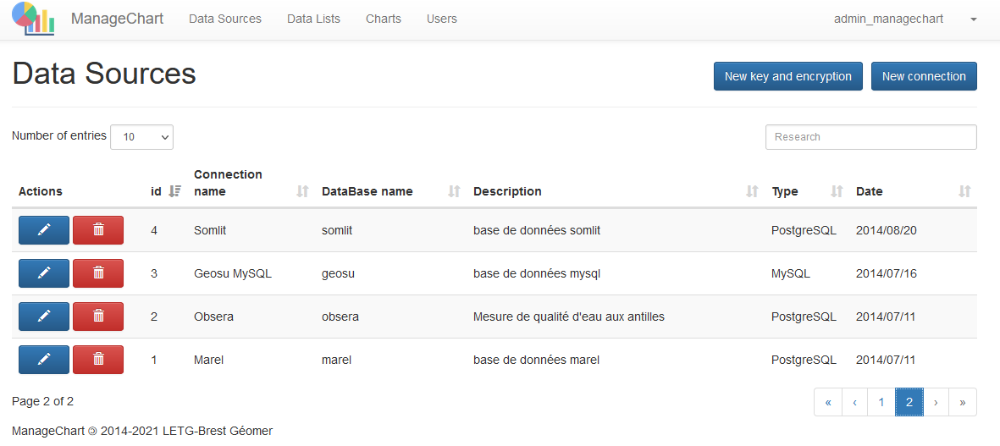
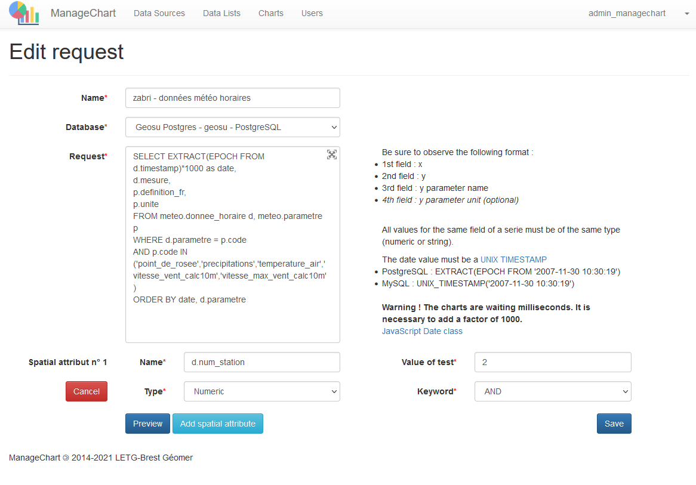
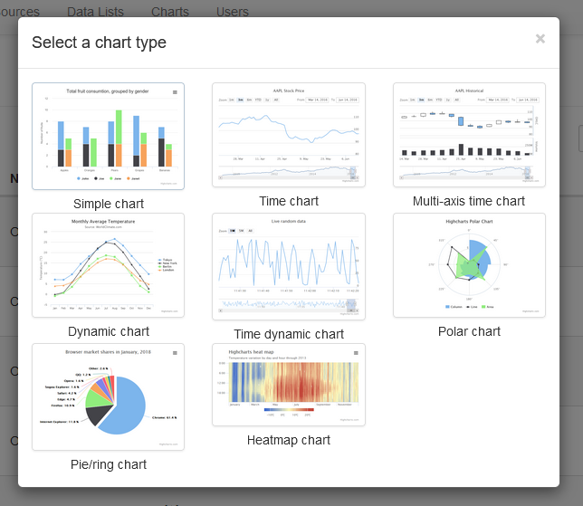
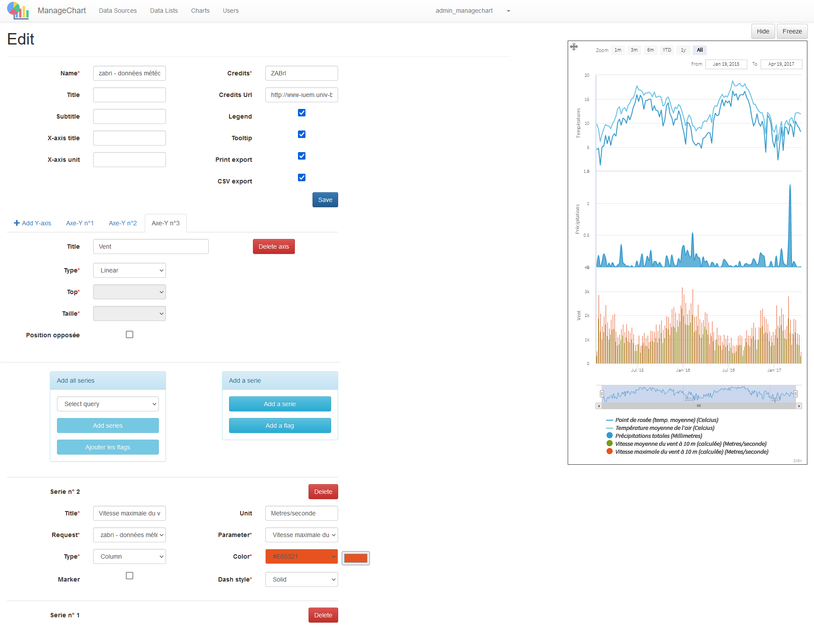
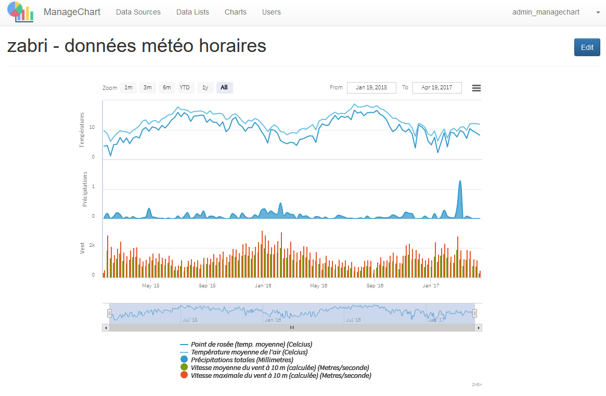

# What is ManageChart ?

Managechart is a web application (PHP + js) which allows you to build interactive charts from SQL queries in databases (Postgresql, MySQL, ...). It is based on the symfony framework and the Highcharts / Stocks Javascript libraries.
The charts thus created can then be embeded into web pages (iframe) and their content and display can be configured by injecting parameters into the URL.
It is particularly suitable for operation with the [geoCMS](https://github.com/LETG/geocms) web mapping viewer

## Features

**1. Connect your datasources (PostgreSQL, MySQL)**



**2. Edit SQL Requests**



**3. Choose a Chart Type**



**4. Edit your chart**



**5. Visualize**



**6. Embed with iframe**


```
https://www-iuem.univ-brest.fr/wapps/managechart/en/chart/show/{{chart id}}/{{width in px or auto}}/{{heigth in px or auto}}/{{parameter in type defined in request}}
```


Exemple : [https://www-iuem.univ-brest.fr/wapps/managechart/en/chart/show/291/800/auto/2](https://www-iuem.univ-brest.fr/wapps/managechart/en/chart/show/291/800/auto/2)

# Installation

## Pre-requisites

- PHP >= 7.2.5
- yarn or npm
- [composer](https://getcomposer.org/download/)
- the [symfony cli](https://symfony.com/download)

## Installing PHP dependencies

```
$ composer install
```

## Installing javascript dependencies

```
$ yarn install
```

## Creating javascript bundles

For development run

```
$ yarn run dev
```

For production run

```
$ yarn run build
```

## Setting up the database

The default database configuration can be found in the `.env` file, under the
`DATABASE_URL` variable.

Migration
```
php bin/console doctrine:migrations:migrate
```
## Launching a local server for development

```
$ symfony server:start
```
